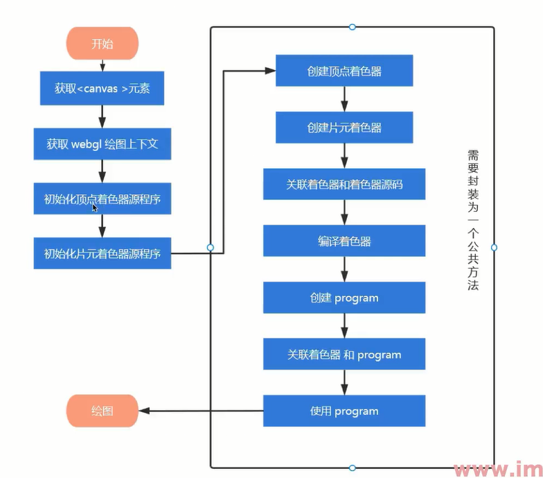

# webGL基础

## 简单介绍

1. canvas画布 二维Canvas api 三维 web GL api
2. canvas.getContext(’webgl’);
3. canvas.getContext(’webgl2’);
4. webgl是绘图协议，结合html显示3d图像
5. 可实现功能：数据可视化（图表）、图形/ 游戏引擎、图形渲染、
                      地图、VR、场景展示、城市规划
6. 优势：内嵌在浏览器
7. 着色器是以字符串形式存储在js中
8. 开源框架的使用，避免兼容逻辑的麻烦
9. 常见的webGL框架：
three — webGL库
Babylon — 图像引擎
kick — 游戏引擎
clayGL — 3D应用
playCanvas — 网络游戏
WebGLStudio & Litescene — 图像编辑器
Luma — 数据可视化
A-Frame — AR

## 入门

1. 创建一个canvas标签，设置宽高
2. 添加文字“此浏览器不支持canvas”
3. document.getElementId(’canvas’)
4. ctx.getContext(’webgl’)
5. gl.clearColor(r,g,b,a);   0.0~1.0 重新附着颜色
6. gl.clear();   清空canvas 
三个参数：
gl.COLOR_BUFFER_BIT 清空颜色缓存 搭配gl.clearColor(r,g,b,a)
gl.DEPTH_BUFFER_BIT 清空深度缓冲区 搭配gl.clearDepth(1.0)
gl.STENCIL_BUFFER_BIT 清空模板缓冲区 搭配gl.clearStencil(0)
7. webGL中所有图行都要使用着色器实现
8. 着色器是让开发者自己编写程序，添加和修改渲染逻辑
9. 着色器分 ：
顶点着色器  位置节点控制  vec4(x,y,z,w齐次坐标)
片元着色器  片元颜色像素控制 vec4(r,g,b,a)
10. 着色器中必须存在main函数，使用参数必须一致 0.0
11. 创建着色器步骤：
① 创建着色器源码
② 创建着色器 gl.createShader(gl.VERTEX_SHADER | gl.FRAGMENT_SHADER)
③ 指定着色器源码 gl.shaderSource(着色器，着色器源码)
④ 此时依然没有使用着色器
⑤ 编译着色器 gl.compileShader(着色器)
⑥ 创建程序对象关联着色器 gl.createProgram(); program会实现实际的功能
⑦ 指定程序对象的顶点着色器和片元着色器gl.attachShader(程序对象，着色器)
⑧ 与webgl关联 gl.linkProgram(程序对象)
⑨ 使用程序对象 gl.useProgram(程序对象)
⑩ 执行绘制 gl.drawArrays(gl.POINT | gl.LINES | gl.TRIANGLES, 开始0, 数量1)

流程图

## attributeb变量

1. 存储限定符attribute 类型vec4 名称aposition ;
2. 只能在顶点着色器中使用
3. gl.getAttribLocation(program, ‘aposition’) 方法返回存储地址
4. gl.vertexAttribf4(存储地址, x,y,z,w); 更改存储地址的值
5. gl.drawArray(program);

## 坐标转换

1. domPosition = ev.target.getBoundingCilentRect();
domx = ev.clientX - domPosition.left;
domY = ev.clientY - domPostion.top;
2. 转换X： 先减去（halfWidth） 再除以 halfWidth
转换： 先（halfHeight）减 值，再除以 halfHeight
3. halfWidth = ctx.offsetWidth / 2;
halfHeight = ctx.offsetHeight / 2;

## uniform变量

1. 修改片元着色器数值
2. 片元着色器需要指定默认精度，而顶点着色器默认高精度
3. recision mediump | highp | lowp float
4. uniform vec4 uColor
5. gl.getUniformLocation(program, ‘uColor’);
6. gl.uniform4f(存储地址, r,g,b,a);  这里4f与vec4对应
7. 想要使用2f gl_FragColor的值需要使用vec4()转换函数
8. 顶点数据是特殊的，而片元数据是统一的