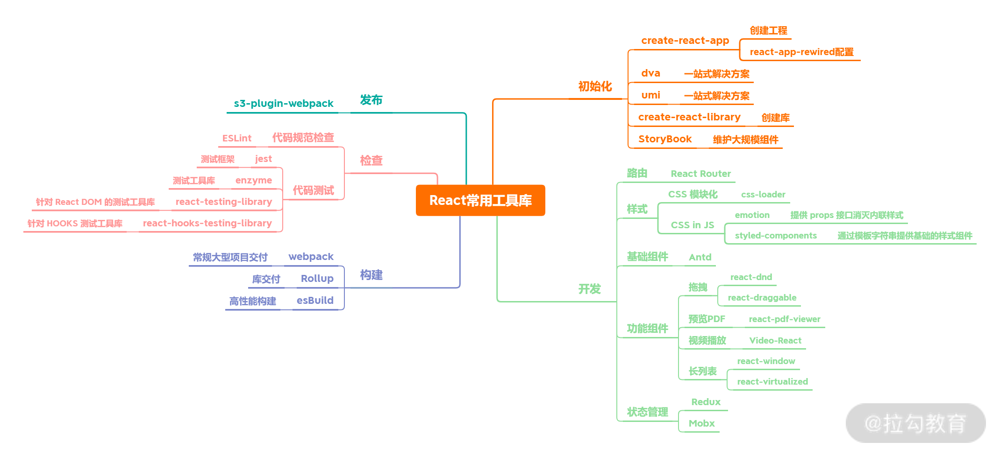

# 常用插件和模块

**工欲善其事，必先利其器*

## 初始化

- 初始化 **[create-react-app]()**
- 初始化 **[react-app-rewired]()**
- 初始化 **[umi]()**
- 初始化 **[dva]()**
- 初始化 **[create-react-library]()** 适合发布组件

### 开发

- 路由 **[React Router]()**
- 样式 **[styled-component]()**
- 样式 **[emotion]()**
- 拖拽库 **[React dnd]()**
- 拖拽库 **[react-draggable]()**
- PDF **[react-pdf-viewer]()**
- 视频 **[Video-React]()**
- 长列表 **[react-window]()**
- 长列表 **[react-virtualized]()**
- 状态管理 **[mobx]()**
- 状态管理 **[redux]()**
- 状态管理 **[Dvajs]()**
- ui组件库 **[ant-design](https://ant-design.antgroup.com/index-cn)**
- 富文本编辑 **[braft-editor](https://github.com/margox/braft-editor)**
- 可视化图表 **[echarts-for-react]()**
- markdown预览器 **[react-markdown]()**
- 二维码展示 **[qrcode.react]()**
- 缓存页面 **[React-keepalive-router]()**

### 构建

- 完备 **[Webpack]()**
- 专注于交付库 **[Rollup]()**
- 打包及压缩工具 **[esbuild]()** 性能足够强

### 检查

- 测试基座 **[jest]()** 负责跑具体的用例
- 测试工具库 **[enzyme]()**
- react的dom测试工具 **[react-testing-library]()**
- hooks测试 **[react-hooks-testing-library]()**
<!-- - name **** -->

**参考：**
[常用的20模块](https://blog.csdn.net/fegus/article/details/126812695?ops_request_misc=&request_id=&biz_id=102&utm_term=react%E9%A1%B9%E7%9B%AE%E4%B8%AD%E5%B8%B8%E7%94%A8%E7%9A%84%E5%B7%A5%E5%85%B7%E5%8C%85&utm_medium=distribute.pc_search_result.none-task-blog-2~all~sobaiduweb~default-2-126812695.nonecase&spm=1018.2226.3001.4187#答题)
