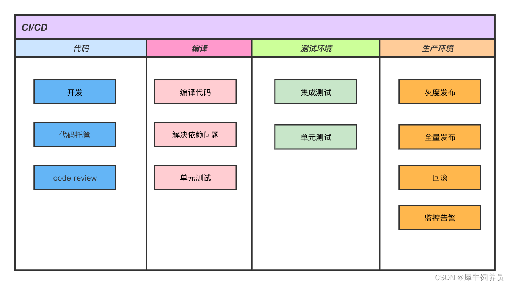

#

## CI/CD

持续集成，CI工具本质上只不过是一个定时器，时间一到，做你让它做的事情，必然要有其它工具与其结合

六点要做到自动化，

(1) 自动化的运行测试； 测试工具

(2) 自动产生可部署的二进制成品； 产生二进制文件工具：Ant，Make等

(3) 自动将成品自动部署到近似生产环境；

(4) 自动为CodeBase打上标签；代码规范检查工具：checkstyle

(5) 自动运行回归测试；

(6) 自动生成度量报告。

## 流程

